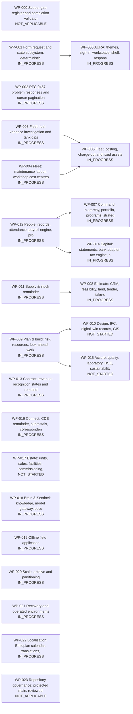

# Work-package dependency graph

Generated by `tools/final_completion.py`.

```mermaid
graph LR
  WP000["WP-000 Scope, gap register and completion validator<br/>NOT_APPLICABLE"]
  WP001["WP-001 Form request and state subsystem; deterministic <br/>IN_PROGRESS"]
  WP002["WP-002 RFC 9457 problem responses and cursor pagination<br/>IN_PROGRESS"]
  WP003["WP-003 Fleet: fuel variance investigation and tank dips<br/>IN_PROGRESS"]
  WP004["WP-004 Fleet: maintenance labour, workshop cost centres<br/>IN_PROGRESS"]
  WP005["WP-005 Fleet: costing, charge-out and fixed assets<br/>IN_PROGRESS"]
  WP003 --> WP005
  WP004 --> WP005
  WP006["WP-006 AURA: themes, sign-in, workspace, shell, respons<br/>IN_PROGRESS"]
  WP001 --> WP006
  WP007["WP-007 Command: hierarchy, portfolio, programs, strateg<br/>IN_PROGRESS"]
  WP012 --> WP007
  WP008["WP-008 Estimate: CRM, feasibility, land, tender, take-o<br/>IN_PROGRESS"]
  WP011 --> WP008
  WP009["WP-009 Plan & build: risk, resources, look-ahead, work <br/>IN_PROGRESS"]
  WP010["WP-010 Design: IFC, digital twin records, GIS<br/>NOT_STARTED"]
  WP009 --> WP010
  WP011["WP-011 Supply & stock remainder<br/>IN_PROGRESS"]
  WP012["WP-012 People: records, attendance, payroll engine, pro<br/>IN_PROGRESS"]
  WP013["WP-013 Contract: revenue-recognition states and remaind<br/>IN_PROGRESS"]
  WP014["WP-014 Capital: statements, bank adapter, tax engine, c<br/>IN_PROGRESS"]
  WP012 --> WP014
  WP015["WP-015 Assure: quality, laboratory, HSE, sustainability<br/>NOT_STARTED"]
  WP009 --> WP015
  WP016["WP-016 Connect: CDE remainder, submittals, corresponden<br/>IN_PROGRESS"]
  WP017["WP-017 Estate: units, sales, facilities, commissioning,<br/>NOT_STARTED"]
  WP018["WP-018 Brain & Sentinel: knowledge, model gateway, secu<br/>IN_PROGRESS"]
  WP019["WP-019 Offline field application<br/>IN_PROGRESS"]
  WP020["WP-020 Scale, archive and partitioning<br/>IN_PROGRESS"]
  WP021["WP-021 Recovery and operated environments<br/>IN_PROGRESS"]
  WP022["WP-022 Localisation: Ethiopian calendar, translations, <br/>IN_PROGRESS"]
  WP023["WP-023 Repository governance: protected main, reviewed <br/>NOT_APPLICABLE"]
```

Critical path (longest dependency chain): WP-003 → WP-005
